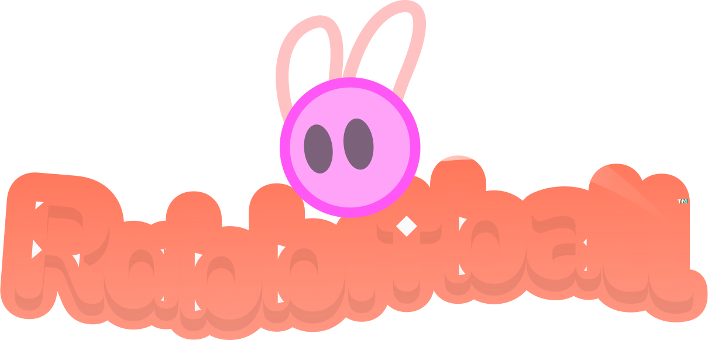

# Rabbitball

**Source-code** for my physics-based puzzle game inspired by Pinball, about a ball with bunny ears . Keep in mind, I sometimes may not maintain or document the code, it's just sitting here with a [CC BY-NC 4.0](https://creativecommons.org/licenses/by-nc/4.0/) License, hope you enjoy! Made in [Godot 4.3](https://godotengine.org/).

### License

### Play the game on

- [**Newgrounds**](https://www.newgrounds.com/portal/view/952625)
- [Game's **Itch.io** Page](https://night-kolo.itch.io/rabbitball)

  
  
  

## Changelog

[`main`](https://github.com/nightkolo/Rabbitball/commits/main/) branch is currently early version `1.2.0`. Unfortunately, I made these changes before learning about branching in git, which are undeniably perfect for versioning, my bad. You can go back to [cb473ae](https://github.com/nightkolo/Rabbitball/tree/cb473ae135068a603ba0f3163895db5d3a36bfc7) to obtain version `1.1`.

### Proposals/Future

  
Version <code>1.2.0</code>

  &emsp; This will hopefully be the last Web Version update, with final tweaks and improvements.

 

 
  
Version <code>1.3.0</code>
 
   &emsp; This is will be the Desktop Version update, with the goal of it being... an actual Desktop version this time.
    
    Desktop-specific options, as well as volume sliders and extra options, will be available. A MacOS release is also planned.

 
 

 
  
Version <code>2.0.0</code>
 
   &emsp; &bullet; <strong>New Arcade 3 with new mechanics</strong>, Desktop exclusive.

 

<!-- #### Version `1.2.0`

This will hopefully be the last Web Version update, with final tweaks and improvements.

#### Version `1.3.0`

This is will be the Desktop Version update, with the goal of it being... an actual Desktop version this time.

Desktop-specific options, as well as volume sliders and extra options, will be available. A MacOS release is also planned.

#### Version `2.0.0`

- **New Arcade 3 with new mechanics**, Desktop exclusive. -->

## Import, Run, and Export

Everything is included in the [`rabbitball/`](rabbitball/) directory/folder.

Import the `rabbitball/` directory in the Godot Engine.

WIP.

## Copyright

*&#169; 2024-2025 Night Kolo* 